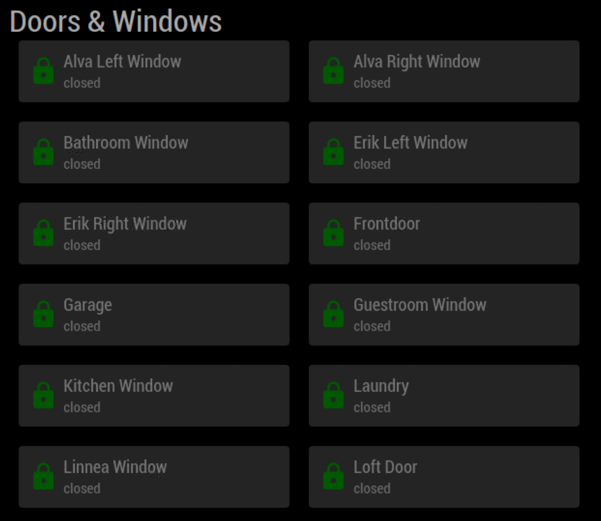
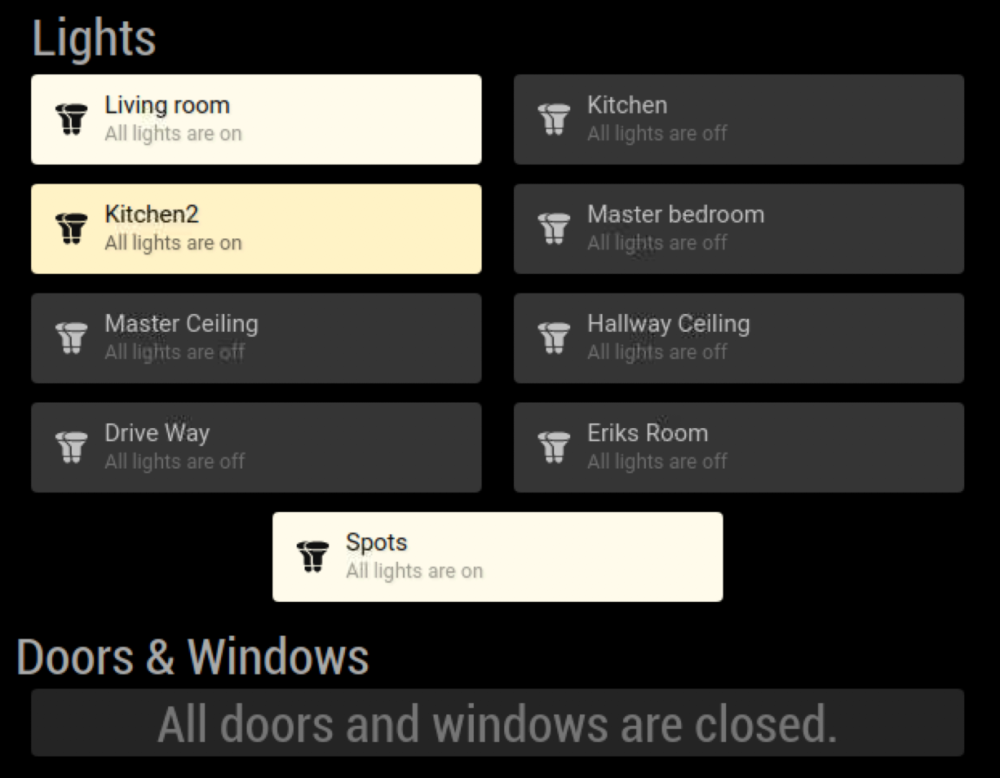

# MMM-Smartthings

This is a module for the [MagicMirror²](https://github.com/MichMich/MagicMirror/).

MagicMirror module that connects to the Samsung Smartthings api to display device status information.

This is a fork of the [MMM-Smartthings](https://github.com/buzzkc/MMM-Smartthings) module by buzzkc. This module has been changed to copy the display style of the [mmm-hue-lights](https://github.com/michael5r/mmm-hue-lights) module by michael5r.

Additionally all sensor types are now listed as their own category. This has forced major changes to the configuration.

## Example




## Dependencies

* An installation of [MagicMirror<sup>2</sup>](https://github.com/MichMich/MagicMirror)
* npm
* [smartthings-node](https://www.npmjs.com/package/smartthings-node)

## Installation
### Setup the MagicMirror module
```bash
cd ~/MagicMirror/modules
git clone https://github.com/ulrichwisser/MMM-Smartthings.git
cd MMM-Smartthings
npm install
```

### Using the module

To use this module, add the following configuration block to the modules array in the `config/config.js` file:
```js
var config = {
    modules: [
        {
              module: "MMM-Smartthings",
              position: "top_left",
              header: "Smartthings",
              config: {
                personalAccessToken: 'your_smarthings_api_key',
                capabilities: [
                    'contactSensor',
                    'lock'
                ],
                contactSensor: {
                    title: "Doors & Windows",
                    skipClosed: 1,
                    summary: {
                        all: "All doors and windows are closed.",
                        part: "All other doors and windows are closed.",
                    }    
                },
                lock: {
                    title: "Doorlocks",
                }
                excludedDeviceNames: [
                    'Sense-', // Contains this text
                    'Virtual Lock Test' // Or is a specific device label
                ]
              }
        }
    ]
}
```

## Configuration options

| Option                |             | Description
|-----------------      |-----------  |-----------------
| `personalAccessToken` | *Required*  | Setup your personal access token at https://account.smartthings.com/tokens
| `capabilities`        | *Required*  | An array of device capabilities to display statuses for. Supported capabilities: "switch", "contactSensor", "lock", "temperatureMeasurement", "relativeHumidityMeasurement", & "motionSensor"
| `updateInterval`      | *Optional*  | The number of milliseconds between updates<br>**Type:** `int`(milliseconds) <br>Default 30000 milliseconds (30 seconds)
| `excludedDeviceNames` | *Optional*  | An array of device names or strings contained in the device label, can be excluded by containing a given word or the full name. Be more specific if devices you want to see are getting excluded.

Additionally all capabilitites listed in 'capabilities' must have their own config option.

### switch
| Option                |             | Description
|-----------------      |-----------  |--------------
| title                 | *Optional*  | The sub-heading title for device list


### contactSensor
| Option                |             | Description
|-----------------      |-----------  |--------------
| title                 | *Optional*  | The sub-heading title for device list
| skipClosed            | *Optional*  | Set to 1 hides all closed sensors

### lock
| Option                |             | Description
|-----------------      |-----------  |--------------
| title                 | *Optional*  | The sub-heading title for device list

### temperatureMeasurement
| Option                |             | Description
|-----------------      |-----------  |--------------
| title                 | *Optional*  | The sub-heading title for device list

### relativeHumidityMeasurement
| Option                |             | Description
|-----------------      |-----------  |--------------
| title                 | *Optional*  | The sub-heading title for device list

### motionSensor
| Option                |             | Description
|-----------------      |-----------  |--------------
| title                 | *Optional*  | The sub-heading title for device list


## Future Enhancements
* Refactor to allow multiple instances of module.
* Add additional capabilities: https://docs.smartthings.com/en/latest/capabilities-reference.html
* Filter by location, currently all devices for all locations shown.


## Thanks To
* MichMich for developing [MagicMirror<sup>2</sup>](https://github.com/MichMich/MagicMirror)
* buzzkc for developing the original MMM-Smartthings module
